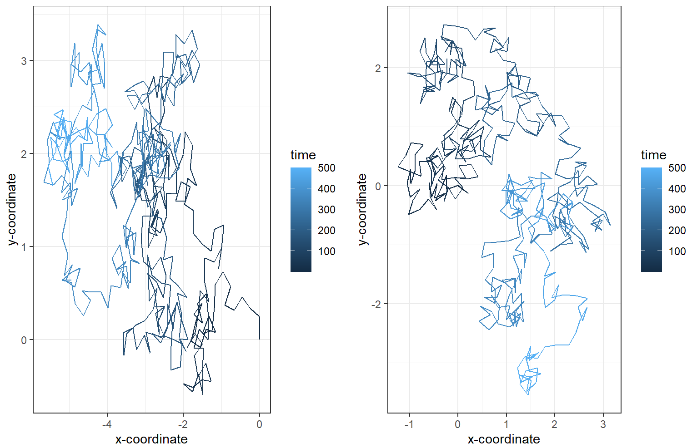
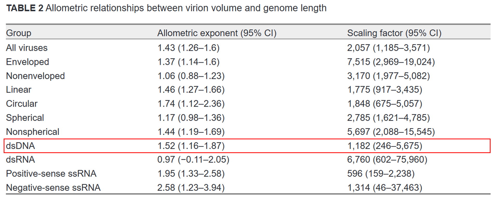

# Reproducible research: version control and R

\# INSERT ANSWERS HERE \#

#### Question 4



a)  Executing the code produces a side by side grid of two random walk plots (produced from data1 and data2 respectively). As is to be expected, the plots both show unique paths, as they are both generated from a script producing random walks. Time is illustrated using a gradient colour scheme, from darker blue to lighter blue, and this allows us to visualise how the random walks change over time (with earlier steps in darker blue and later steps in lighter blue). Each step on the random walk is set to 0.25 units, and the walk is iterated over 500 steps with a random angle between 0 and 2pi chosen for each step. Combining the angle and step length information leads to x and y coordinates being computed after each step. We can clearly see that both paths begin from the origin, but as the random nature of the walk takes over, they begin to follow very different patterns. On both plots, there are areas where the path seems to be returning over itself over and over again, before going on a longer path without seemingly going back on itself.

b)  Put simply, a random seed is the initial value that is given to initialise a random number generator. Using a random seed is important in order to ensure reproducibility, as it allows for control over the sequence of numbers generated by a random number generated. Random number generators therefore are really only generating pseudo-random numbers, which are based on a fixed random seed starting point. Every number in the sequence can be traced back to its previous one, and eventually all the way back to the seed.

    In an experiment like this, it is useful to have a random seed as it allows us to run the same 'random' process over and over again, whilst still allowing for consistency and comparison (as we know that if a seed is reused, the same sequence will follow. This is what we need to include in our model. In order to make a reproducible simulation of Brownian motion, we should be able to set a random seed. Then, each time a different seed is randomly chosen, there is a defined 'path' that follows from it.

c)  In order to make a reproducible simulation of Brownian motion, I will adjust the code to include a random seed.

#### Question 5

a)  There are 33 rows and 13 columns in the table (which I determined with the below code).

```{r}
str(Cui_etal2014)
```

b)  We have been told that the relationship can be modelled using an allometric equation of the form V = α(L\^β). Applying a log transformation to this will allow us to fit a linear model to the data, of the form y = c + mx.

    Applying the transformation:

    log(V) = ln(α(L\^β))

    ln(V) = ln(α) + βln(L)

```{r}
#Generating my dataframe
library(here)
virion_data <- read.csv(here("question-5-data","Cui_etal2014.csv"))
virion_data

#Adding our log data to the dataset

virion_data$log_virion_volume <- log(virion_data$Virion.volume..nm.nm.nm.)
virion_data$log_genome_length_kb <- log(virion_data$Genome.length..kb.)

#Fitting our linear model

linear_model <- lm(virion_data$log_virion_volume ~ virion_data$log_genome_length_kb, data = virion_data)

summary(linear_model)


```

c)  The estimate for the intercept of our graph (ln(α)) is given as 7.0748. Therefore the scale factor α is equal to e\^7.0748 = 1181.81

The associated p value for the intercept is 2.28e-10, which is highly statistically significant (far below the typical significance level threshold of 0.05, as well as more stringent thresholds such as 0.01).

The estimate for the gradient of our graph (β) is given as 1.5152. Therefore the exponent β is equal to 1.52

The associated p value for the gradient is 6.44e-10, which is highly statistically significant (far below the typical significance level threshold of 0.05, as well as more stringent thresholds such as 0.01).

(The above values were found when running the code in question b)).

The paper gives the following highlighted values for dsDNA viruses:



My exponent and scaling factor are therefore the same as found in the paper, when rounded to the nearest whole number.

d)  Below is the code used to produce the figure.

```{r}
ggplot(data = virion_data, aes(x=log_genome_length_kb, y=log_virion_volume)) + 
  geom_point() +
  xlab("log [Genome length (kb)]") + 
  ylab("log [Virion volume (nm3)]") +
  geom_smooth(method = 'lm') +
  theme_minimal() +
  theme(panel.border = element_rect(color = "black", fill = NA, size = 1))
```

e\. What is the estimated volume of a 300 kb dsDNA virus?

V = α(L\^β)

α = 1181.81

β = 1.52

V = 1181.81\*(300\^1.52)

V = 6882908.048 nm\^3

Therefore the volume of a 300kb dsDNA virus is approximately 6880000 nm\^3.

## Instructions

The homework for this Computer skills practical is divided into 5 questions for a total of 100 points. First, fork this repo and make sure your fork is made **Public** for marking. Answers should be added to the \# INSERT ANSWERS HERE \# section above in the **README.md** file of your forked repository.

Questions 1, 2 and 3 should be answered in the **README.md** file of the `logistic_growth` repo that you forked during the practical. To answer those questions here, simply include a link to your logistic_growth repo.

**Submission**: Please submit a single **PDF** file with your candidate number (and no other identifying information), and a link to your fork of the `reproducible-research_homework` repo with the completed answers (also make sure that your username has been anonymised). All answers should be on the `main` branch.

## Assignment questions

1)  (**10 points**) Annotate the **README.md** file in your `logistic_growth` repo with more detailed information about the analysis. Add a section on the results and include the estimates for $N_0$, $r$ and $K$ (mention which \*.csv file you used).

2)  (**10 points**) Use your estimates of $N_0$ and $r$ to calculate the population size at $t$ = 4980 min, assuming that the population grows exponentially. How does it compare to the population size predicted under logistic growth?

3)  (**20 points**) Add an R script to your repository that makes a graph comparing the exponential and logistic growth curves (using the same parameter estimates you found). Upload this graph to your repo and include it in the **README.md** file so it can be viewed in the repo homepage.

4)  (**30 points**) Sometimes we are interested in modelling a process that involves randomness. A good example is Brownian motion. We will explore how to simulate a random process in a way that it is reproducible:

    a)  A script for simulating a random_walk is provided in the `question-4-code` folder of this repo. Execute the code to produce the paths of two random walks. What do you observe? (10 points)\
    b)  Investigate the term **random seeds**. What is a random seed and how does it work? (5 points)\
    c)  Edit the script to make a reproducible simulation of Brownian motion. Commit the file and push it to your forked `reproducible-research_homework` repo. (10 points)\
    d)  Go to your commit history and click on the latest commit. Show the edit you made to the code in the comparison view (add this image to the **README.md** of the fork). (5 points)

5)  (**30 points**) In 2014, Cui, Schlub and Holmes published an article in the *Journal of Virology* (doi: <https://doi.org/10.1128/jvi.00362-14>) showing that the size of viral particles, more specifically their volume, could be predicted from their genome size (length). They found that this relationship can be modelled using an allometric equation of the form $`V = \alpha L^{\beta}`$, where $`V`$ is the virion volume in nm<sup>3</sup> and $`L`$ is the genome length in nucleotides.

    a)  Import the data for double-stranded DNA (dsDNA) viruses taken from the Supplementary Materials of the original paper into Posit Cloud (the csv file is in the `question-5-data` folder). How many rows and columns does the table have? (3 points)\
    b)  What transformation can you use to fit a linear model to the data? Apply the transformation. (3 points)\
    c)  Find the exponent ($\beta$) and scaling factor ($\alpha$) of the allometric law for dsDNA viruses and write the p-values from the model you obtained, are they statistically significant? Compare the values you found to those shown in **Table 2** of the paper, did you find the same values? (10 points)\
    d)  Write the code to reproduce the figure shown below. (10 points)

<p align="center">


</p>

e)  What is the estimated volume of a 300 kb dsDNA virus? (4 points)

```{r}
sink(file = "package-versions.txt")
sessionInfo()
sink()
```
